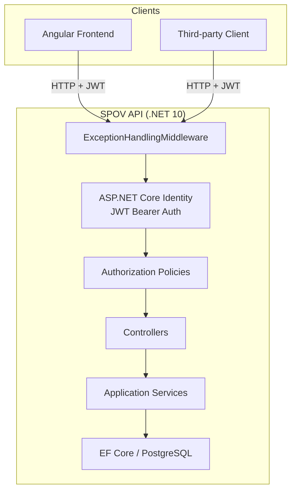
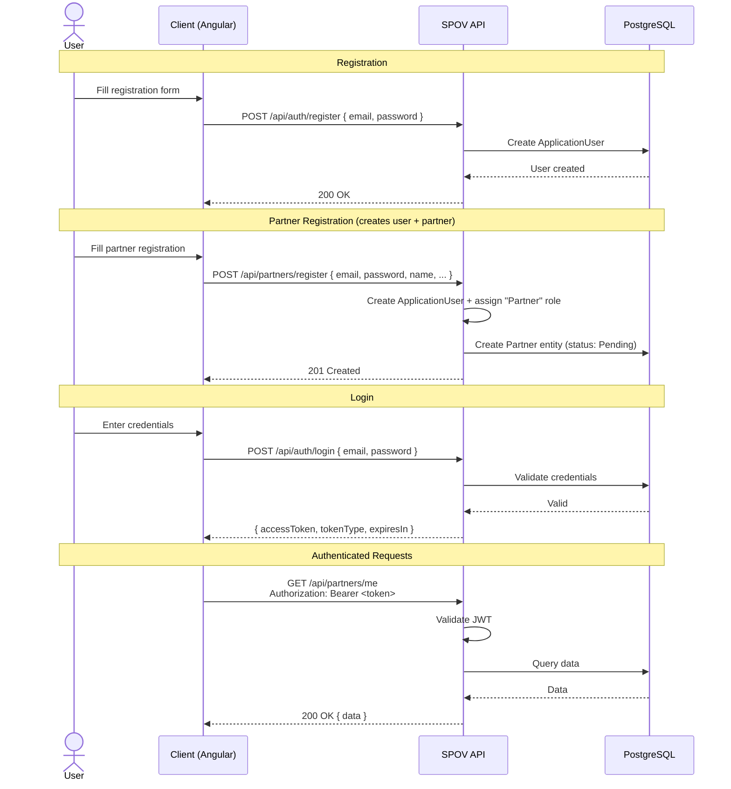
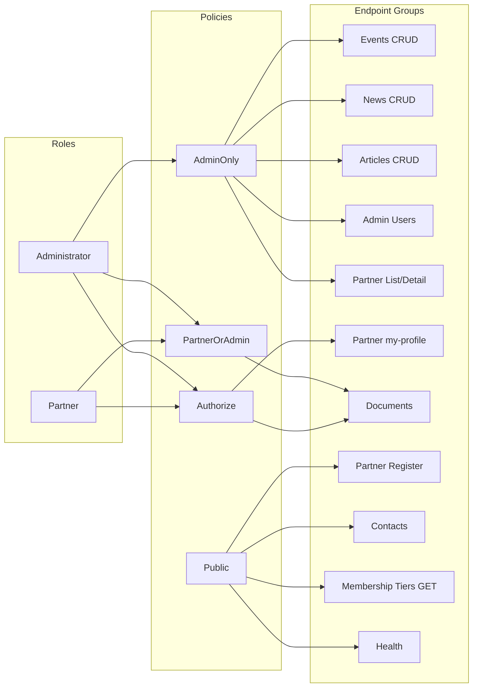

# SPOV API Reference

## Architecture Overview



---

## Authentication

Authentication uses **ASP.NET Core Identity** with **JWT Bearer tokens**, mapped under the `/api/auth` route group.

### Auth Flow



### Auth Endpoints (`/api/auth`)

All Identity endpoints are auto-generated by `MapIdentityApi<ApplicationUser>()`.

| Method | Path | Auth | Description |
|--------|------|------|-------------|
| POST | `/api/auth/register` | No | Register a new user |
| POST | `/api/auth/login` | No | Login, returns JWT access token |
| POST | `/api/auth/refresh` | Token | Refresh expired access token |
| POST | `/api/auth/logout` | Yes | Revoke refresh token |
| POST | `/api/auth/confirmEmail` | No | Confirm email address |
| POST | `/api/auth/resendConfirmationEmail` | No | Resend confirmation email |
| POST | `/api/auth/forgotPassword` | No | Request password reset |
| POST | `/api/auth/resetPassword` | No | Reset password with token |
| GET | `/api/auth/manage/info` | Yes | Get current user profile info |
| POST | `/api/auth/manage/info` | Yes | Update user profile info |
| POST | `/api/auth/manage/2fa` | Yes | Manage two-factor authentication |

> **Note:** The login response contains `accessToken`. Store it and send as `Authorization: Bearer <token>` on all authenticated requests.

---

## Authorization

### Role Model

Two roles are defined:

| Role | Constant | Description |
|------|----------|-------------|
| `Administrator` | `Roles.Administrator` | Full system access |
| `Partner` | `Roles.Partner` | Limited partner access |

### Policies

| Policy | Required Roles | Applied To |
|--------|----------------|------------|
| `"AdminOnly"` | `Administrator` | Admin CRUD operations |
| `"PartnerOrAdmin"` | `Partner` or `Administrator` | Document endpoints |
| `[Authorize]` (no policy) | Any authenticated user | Own profile access |



### Seed Data

On startup, the application seeds:
- **Roles:** `Administrator`, `Partner`
- **Admin user:** `admin@spov.pt` / `Admin123!` (role: `Administrator`)

---

## API Endpoints

### Health

| Method | Path | Auth | Description |
|--------|------|------|-------------|
| GET | `/health` | No | Health check |

---

### Partners (`/api/partners`)

| Method | Path | Auth | Policy | Description |
|--------|------|------|--------|-------------|
| GET | `/api/partners` | Yes | AdminOnly | List all partners |
| GET | `/api/partners/{id}` | Yes | AdminOnly | Get partner by ID |
| GET | `/api/partners/me` | Yes | [Authorize] | Get own partner profile by user ID |
| GET | `/api/partners/my-profile` | Yes | [Authorize] | Get own profile with payment history |
| POST | `/api/partners/register` | No | Public | Register a new partner |
**`POST /api/partners/register`** is special: it creates both an `ApplicationUser` (with `Partner` role) and a `Partner` entity (status: `Pending`) in a single flow.

---

### Events (`/api/events`)

| Method | Path | Auth | Policy | Description |
|--------|------|------|--------|-------------|
| GET | `/api/events` | No | Public | List all events |
| GET | `/api/events/{id}` | No | Public | Get event by ID |
| POST | `/api/events` | Yes | AdminOnly | Create a new event |
| PUT | `/api/events/{id}` | Yes | AdminOnly | Update an event |
| DELETE | `/api/events/{id}` | Yes | AdminOnly | Delete an event |

---

### Event Registrations (`/api/events/{eventId}/registrations`)

| Method | Path | Auth | Policy | Description |
|--------|------|------|--------|-------------|
| GET | `/api/events/{eventId}/registrations` | Yes | AdminOnly | List registrations for an event |
| POST | `/api/events/{eventId}/registrations` | Yes | [Authorize] | Register a partner for an event |

---

### News (`/api/news`)

| Method | Path | Auth | Policy | Description |
|--------|------|------|--------|-------------|
| GET | `/api/news` | No | Public | List all news posts |
| GET | `/api/news/{id}` | No | Public | Get news post by ID |
| POST | `/api/news` | Yes | AdminOnly | Create a news post |
| PUT | `/api/news/{id}` | Yes | AdminOnly | Update a news post |
| DELETE | `/api/news/{id}` | Yes | AdminOnly | Delete a news post |

---

### Articles (`/api/articles`)

| Method | Path | Auth | Policy | Description |
|--------|------|------|--------|-------------|
| GET | `/api/articles` | No | Public | List all articles |
| POST | `/api/articles` | Yes | AdminOnly | Create a new article |

---

### Contacts (`/api/contacts`)

| Method | Path | Auth | Policy | Description |
|--------|------|------|--------|-------------|
| POST | `/api/contacts` | No | Public | Submit a contact message |

---

### Membership Tiers (`/api/membership-tiers`)

| Method | Path | Auth | Policy | Description |
|--------|------|------|--------|-------------|
| GET | `/api/membership-tiers` | No | Public | List all membership tiers |
| GET | `/api/membership-tiers/{id}` | Yes | AdminOnly | Get membership tier by ID |

---

### Payments (`/api/partners/{partnerId}/payments`)

| Method | Path | Auth | Policy | Description |
|--------|------|------|--------|-------------|
| GET | `/api/partners/{partnerId}/payments` | Yes | AdminOnly | List payments for a partner |

---

### Documents (`/api/documents`)

| Method | Path | Auth | Policy | Description |
|--------|------|------|--------|-------------|
| GET | `/api/documents` | Yes | PartnerOrAdmin | List documents (own if Partner, all if Admin) |

---

### Admin Users (`/api/admin-users`)

| Method | Path | Auth | Policy | Description |
|--------|------|------|--------|-------------|
| GET | `/api/admin-users` | Yes | AdminOnly | List all admin users |

---

## How to Authenticate (Quick Start)

### 1. Login

```bash
curl -X POST http://localhost:5000/api/auth/login \
  -H "Content-Type: application/json" \
  -d '{"email": "admin@spov.pt", "password": "Admin123!"}'
```

### 2. Use the token

```bash
curl http://localhost:5000/api/partners \
  -H "Authorization: Bearer <accessToken>"
```

### 3. Register as a partner (public)

```bash
curl -X POST http://localhost:5000/api/partners/register \
  -H "Content-Type: application/json" \
  -d '{
    "email": "partner@example.com",
    "password": "Partner123!",
    "fullName": "John Doe"
  }'
```

---

## Error Handling

All errors are handled by `ExceptionHandlingMiddleware` and return a consistent JSON shape:

```json
{
  "error": {
    "code": "NotFound",
    "message": "Partner with ID 42 was not found."
  }
}
```

Error types used: `NotFound`, `Validation`, `Conflict`, `Unauthorized`, `InternalError`.

---

## Summary: Authorization Matrix

```mermaid
graph TB
    subgraph Legend
        direction LR
        L1[🔓 Public]
        L2[🔐 Any Authenticated]
        L3[🛡️ Partner or Admin]
        L4[🔒 Admin Only]
    end

    subgraph Public
        H[/health]
        ER[POST /api/events GET]
        NR[GET /api/news]
        AR[GET /api/articles]
        CR[POST /api/contacts]
        MT[GET /api/membership-tiers]
        PR[POST /api/partners/register]
        AU[POST /api/auth/register]
        AL[POST /api/auth/login]
    end

    subgraph AnyAuthenticated
        MP[GET /api/partners/me]
        MPR[GET /api/partners/my-profile]
        ERS[POST /api/events/*/registrations]
    end

    subgraph PartnerOrAdmin
        DL[GET /api/documents]
    end

    subgraph AdminOnly
        PL[GET /api/partners]
        PG[GET /api/partners/*]
        EC[POST /api/events]
        EU[PUT /api/events/*]
        ED[DELETE /api/events/*]
        RG[GET /api/events/*/registrations]
        NC[POST /api/news]
        NU[PUT /api/news/*]
        ND[DELETE /api/news/*]
        AC[POST /api/articles]
        MIG[GET /api/membership-tiers/*]
        PG2[GET /api/partners/*/payments]
        AUL[GET /api/admin-users]
    end
```
